# SURGE

Surf Ramp Generator: a Blender addon that builds surf ramps for [SurfsUp](https://store.steampowered.com/app/3454830/SurfsUp/) and Godot 4.

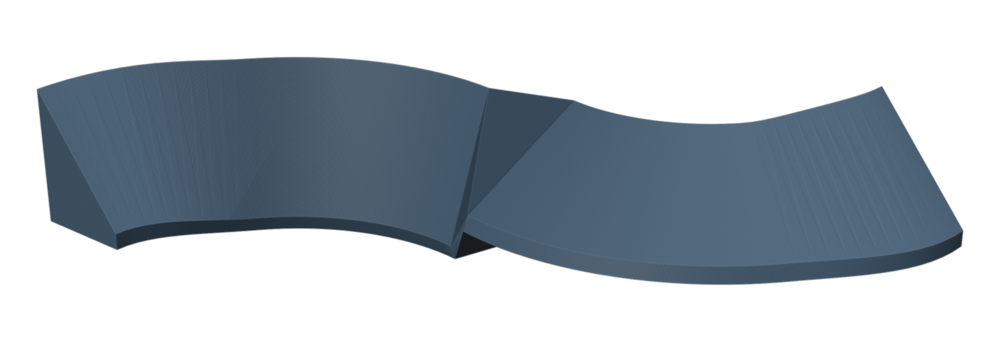

This is a fork of [Kompile's SURGE](https://github.com/Kompile/SURGE), retargeted from Source engine map making to SurfsUp map making.
It works in Hammer units but writes metric meshes that Godot imports with collision already wired up.
If you are still making Source maps, use the 1.x releases; the physics mesh and the QC workflow are gone from 2.0.

## Install

1. Download `surge-<version>.zip` from the [latest release](https://github.com/SurfsUpGame/SURGE/releases/latest).
2. Drag it into Blender, or use Edit > Preferences > Add-ons > Install from Disk.

Needs Blender 4.2 or newer, tested on 5.2 LTS.

## Use it

Open the `SURGE` tab in the 3D viewport sidebar (`N`) and hit **Add New Ramp**.

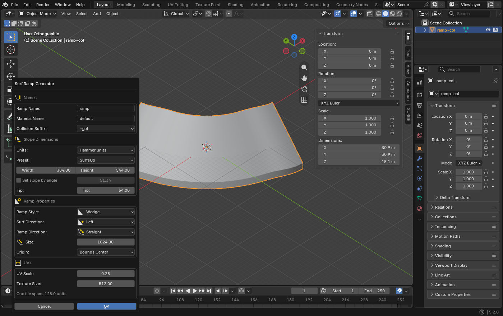

Everything lives in that one dialog.

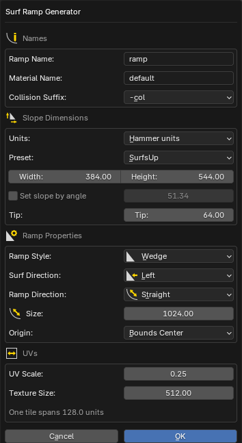

## What comes out

One object named `<your name>-col`, sitting at the 3D cursor, with its origin on the geometry and a scale of exactly (1, 1, 1).

Godot's scene importer reads the `-col` suffix and builds this at import time:

```
your_ramp        MeshInstance3D
└── StaticBody3D
    └── CollisionShape3D   ConcavePolygonShape3D (trimesh)
```

Nothing to wire up by hand.
The suffix dropdown also offers `-colonly` for collision only and `-convcol` for a convex hull.

## Scale

SurfsUp treats one Hammer unit as one inch, the same 39.37 units per metre the game hard-codes as `SOURCE_MULT`.
Type your dimensions in Hammer units and SURGE converts the mesh to metres on generate, so a ramp lands next to existing map geometry at the right size.
Switch the Units dropdown to Meters to work metric instead, and the dimension fields convert as you switch.

The **SurfsUp** preset reproduces the profile used by the game's own maps: 384 wide, 544 tall, 64 unit tip, which is a 51.34 degree face.
**Classic SURGE** restores the original 256 by 320 defaults.

A face has to be steeper than 45.573 degrees to be surfable, which is where the game's `ground_normal_min` of 0.7 lands.
Anything shallower is walkable floor, and SURGE says so in the dialog and again on generate.

## Shapes

| | | |
| :---: | :---: | :---: |
| 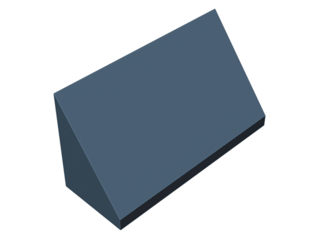<br>Straight | 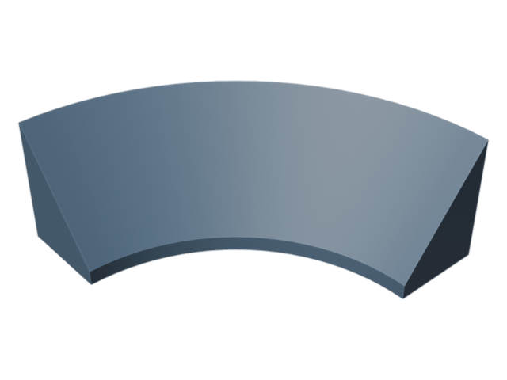<br>Left | 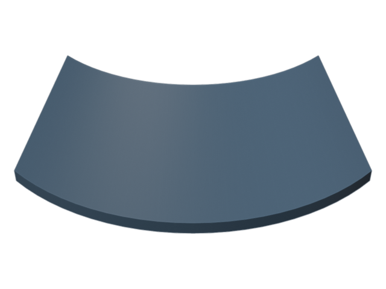<br>Right |
| 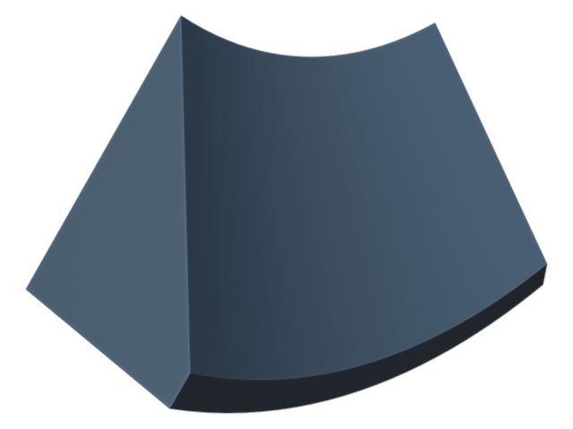<br>Up | 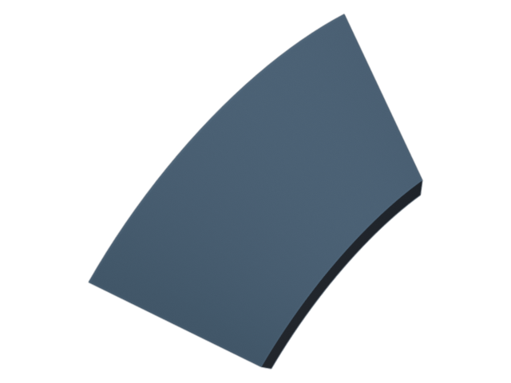<br>Down | 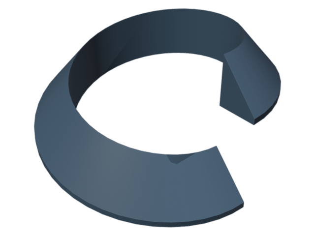<br>Spiral |
| 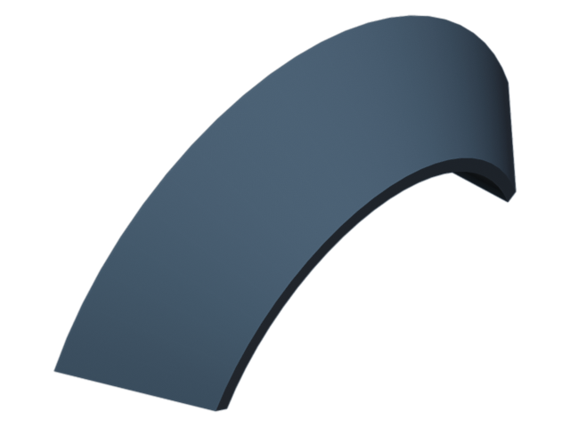<br>Arc | 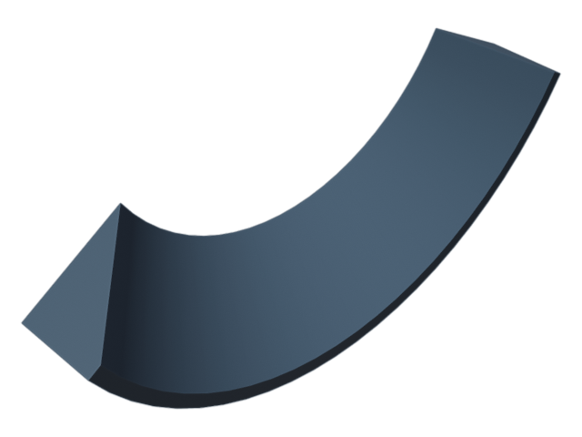<br>Dip | 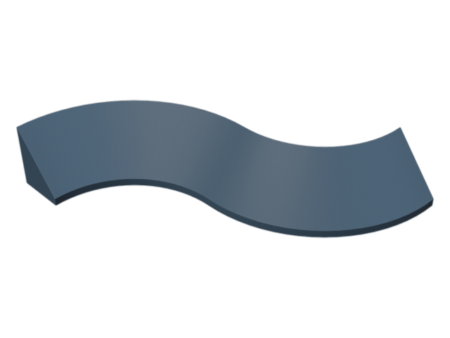<br>S-curve |

Angle sets how far the sweep turns, Size is the inner turn radius, and Spiral takes a Rise on top of that.
An angle of 360 closes a turn into a loop with no end caps.
Bank rolls the cross-section into the corner on any turning shape, eased in and out at the ends.

| | | |
| :---: | :---: | :---: |
| <br>Wedge style | 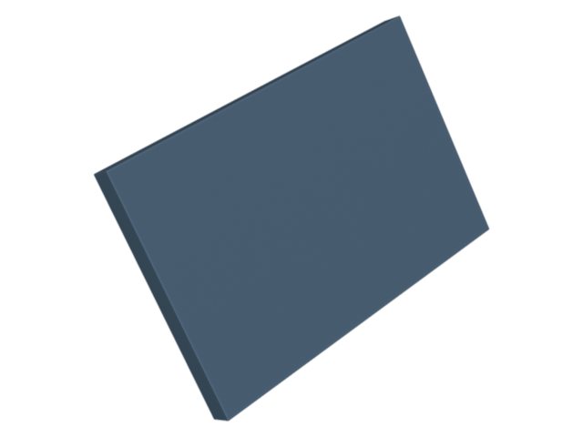<br>Thin style | 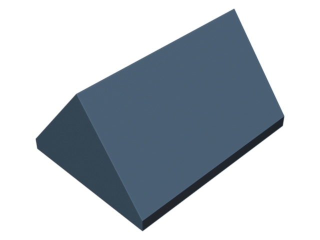<br>Surf both sides |

Wedge gives a solid ramp, and a Tip above zero leaves a blunt edge at the thin end instead of a knife edge.
Thin gives a slab of even thickness following the slope.

## UVs

UVs are computed from distance along the sweep and across the profile, so they tile evenly on every shape and never stretch through a turn.
One tile spans `Texture Size * UV Scale` units, matching Source texture scale conventions: a 512 texture at scale 0.25 covers 128 units.

## Tests

```bash
blender -b --factory-startup --python tests/run_tests.py
```

The suite generates every style, surf direction and shape combination and checks the mesh is manifold, correctly scaled, properly named, and fully UV mapped.

## Releases

Pushing a `v*` tag runs the tests, builds the extension and publishes the zip as a GitHub release.
The tag has to match the version in `blender_manifest.toml`.

## Docs images

Every image above is generated, so they stay honest when the geometry changes:

```bash
blender -b --factory-startup --python docs/render_docs.py
blender --factory-startup --no-window-focus --enable-event-simulate \
    --window-geometry 0 0 1400 880 --python docs/capture_ui.py
```

## Credits

SURGE was written by Kompile for Source engine surf maps, and the original [tutorial video](https://youtu.be/WWZm1lRNFAs) still covers the basics.
Licensed GPL-3.0-or-later, same as the original.
SurfsUp lives at [surfsup.website](https://surfsup.website/) and on [Steam](https://store.steampowered.com/app/3454830/SurfsUp/).
